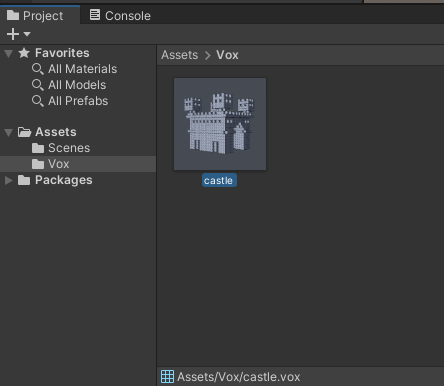
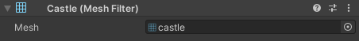
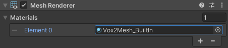
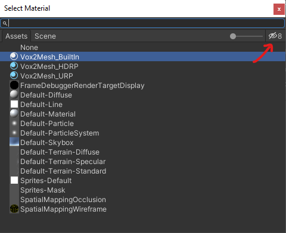
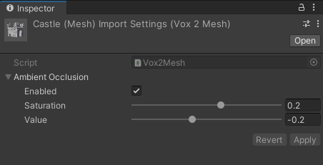

<h1>Vox2Mesh</h1>
.vox importer for Unity

 

## Installation
1. In the Unity Editor, select **Window > Package Manager**.
2. Press the ➕ icon, then select **Add package from git URL...**
3. Paste `https://github.com/pixldev/Vox2Mesh.git`, then press **Add**.

## Usage
- After installing the package, all .vox files will behave like meshes automatically.  

- To display a mesh, simply drag it into a Mesh Filter component.  

- To display its colors, add a material to a Mesh Renderer component. The package comes with a different material for each render pipeline.  
  
To see the materials on the list, you may need to press the eye icon in the top right corner of the window.  

- Vox2Mesh also features a baked ambient occlusion system. You can configure it in the inspector, after selecting a .vox file.  

## Compatibility
- Unity 2021.3+
- URP, HDRP, BIRP
